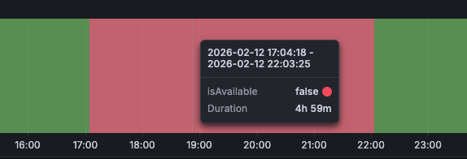
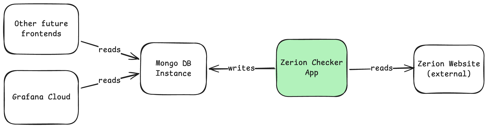

# Zerion Checker

Zerion Checker is a simple tool that checks if a Zerion (<https://zerion.cc>) media website is currently blocked for non-premium users. The tool was meant to help in planning movie dates with my wife :smile:. From the data collected from the Checker App, we can see that the website is blocked for non-premium users mostly from 5 PM to 10 PM every day.

.

**You can check it yourself on the Grafana dashboard [here](https://dawidwijata.grafana.net/public-dashboards/33f6857740d14c6e968cc7ced132e507).**

## High Level Design

An app marked green in the diagram below is a part of this repo. The rest is a cloud infrastructure that needs to be set up separately.



## Features

- Scraping the Zerion website to check if it is blocked for non-premium users
- Structured logging
- Handling timeouts caused by Cloudflare verification
- Integration with MongoDB

## Setup

You can run the project with either local settings, or with docker-compose.

### Prerequisites

#### Option 1: Run it completely locally

- [Node.js >= v22](https://nodejs.org/en/download/)
- [MongoDB](https://www.mongodb.com/try/download/community)

#### Option 2: Run it in Docker

- [Docker](https://www.docker.com/products/docker-desktop)
- [Docker Compose](https://docs.docker.com/compose/)

### Local environment

For quicker setup, it is recommended to use docker-compose: `docker-compose up -d`.

1. Install dependencies: `npm install`
2. Copy `.env.docker` to `.env` and set environment variables in `.env` file. MongoDB variables are especially important as they are used by the project to connect to your MongoDB instance.
3. Run the project: `npm run start`.

### Production environment

The project deployment setup is handled by GitHub Actions. For default setup you can check [deploy.yml](.github/workflows/deploy.yml). You will also need a Linux or Windows system with SSH access, since FreeBSD isn't supported by Playwright.

To work automatically, you will need to set up a CRON job in your production environment to run the project with the sample rate you want.

#### Linux

Use `crontab -e` to open your crontab. For example, add the following line to run the project every 15 minutes:

```bash
*/15 * * * * xvfb-run npm run start --prefix=<path-to-app>
```
